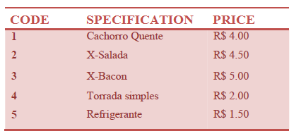

# Snack
Using the following table, write a program that reads a code and the amount of an item. After, print the value to pay. This is a very simple program with the only intention of practice of selection commands.

## Input
The input file contains two integer numbers **X** and **Y**. **X** is the product code and **Y** is the quantity of this item according to the above table.

## Output
The output must be a message "Total: R$ " followed by the total value to be paid, with 2 digits after the decimal point.

| Input Samples |  Output Samples  |
|---------------|------------------|
| 3 2           | Total: R$ 10.00  |
| 4 3           | Total: R$ 6.00   |
| 2 3           | Total: R$ 13.50  |