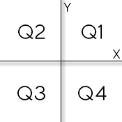

# Coordinates of a Point
Write an algorithm that reads two floating values (x and y), which should represent the coordinates of a point in a plane. Next, determine which quadrant the point belongs, or if you are at one of the Cartesian axes or the origin (x = y = 0).

If the point is at the origin, write the message "Origem".

If the point is at X axis write "Eixo X", else if the point is at Y axis write "Eixo Y".

## Input
The input contains the coordinates of a point.

## Output
The output should display the quadrant in which the point is.

| Input Samples | Output Samples |
|---------------|----------------|
| 4.5 -2.2      | Q4             |
| 0.1 0.1       | Q1             |
| 0.0 0.0       | Origem         |