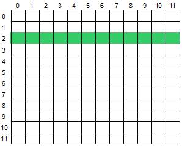

# Line in Array
Your job in this problem is to read a number that is a line of an array, an uppercase character, indicating the operation to be performed and all elements of a bidimentional array **M**[12][12]. Then, you have to calculate and print the sum or average of all elements within the green area according to the case. The following figure illustrates the case when is entered the number 2 to the array line, showing all elements that must be considered in the operation.

## Input
The first line of the input contains a simple integer **L** (0 ≤ **L** ≤ 11) indicating the line to be considered in the operation. The second line of the input contains a single uppercase character T ('S' or 'M'), indicating the operation Sum or Average (Média in portuguese) to be performed with the elements of the array. Follow the 144 floating-point numbers of the array, considering that the elements are inserted line by line, from line 0 to line 11, always from left to right.

## Output
Print the calculated result (sum or average), with one digit after the decimal point.

|                   Input Samples                  | Output Samples |
|--------------------------------------------------|----------------|
| 2  S  1.0  -3.5  2.5  4.1  ... | 12.6           |