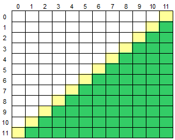

# Below the Secundary Diagonal
Read an uppercase character that indicates an operation that will be performed in an array **M**[12][12]. Then, calculate and print the sum or average considering only that numbers that are below of the Secundary diagonal of the array, like shown in the following figure (green area).

## Input
The first line of the input contains a single uppercase character **O** ('S' or 'M'), indicating the operation Sum or Average (Média in portuguese) to be performed with the elements of the array. Follow 144 floating-point numbers of the array.

## Output
Print the calculated result (sum or average), with one digit after the decimal point.

|                    Input Samples                   | Output Samples |
|----------------------------------------------------|----------------|
| S  5.0  0.0  -3.5  2.5  4.1  ... | 12.6           |