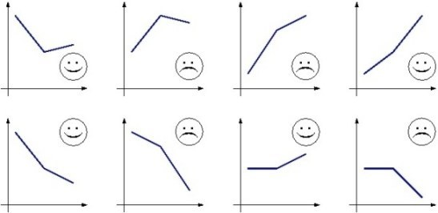

# Welcome to the Winter!
Welcome to the Erechim Winter School of the ICPC Brazilian Subregional Contest! We sincerely hope you learn a lot during these days so you can be very successful in the Programming contests yet to come, but above all we hope you enjoy the School, for when we have fun and enjoy ourselves studying and programming, the training stops being a burden and becomes a hobby. So, have fun!

The winter is a wonderful season, is it not? We all love wearing a poncho, joining a *chimarrão* circle, baking *pinhões* in a wooden burning stove… But not everyone likes the winter, especially in places where winter uses to be very cruel. In Westeros, for example, the people's humour is defined according to climate tendencies. Based on the temperatures of the last three days, the people can be sad or happy, being more likely to make war or to make love, respectively. And, let us be honest, it is precisely because of the scenes of love and war that we love Game of Thrones!

- If the temperature decreased from the 1ˢᵗ to the 2ⁿᵈ day, but increased or remained constant from the 2ⁿᵈ to the 3ʳᵈ, the people are happy (first figure).
- If the temperature increased from the 1ˢᵗ to the 2ⁿᵈ day, but decreased or remained constant from the 2ⁿᵈ to the 3ʳᵈ, the people are sad (second figure).
- If the temperature increased from the 1ˢᵗ to the 2ⁿᵈ day and from the 2ⁿᵈ to the 3ʳᵈ, but increased from the 2ⁿᵈ to the 3ʳᵈ less than what had increased from the 1ˢᵗ to the 2ⁿᵈ, the people are sad (third figure).
- If the temperature increased from the 1ˢᵗ to the 2ⁿᵈ day and from the 2ⁿᵈ to the 3ʳᵈ, but increased from the 2ⁿᵈ to the 3ʳᵈ at least what had increased from the 1ˢᵗ to the 2ⁿᵈ, the people are happy (fourth figure).
- If the temperature decreased from the 1ˢᵗ to the 2ⁿᵈ day and from the 2ⁿᵈ to the 3ʳᵈ, but decreased from the 2ⁿᵈ to the 3ʳᵈ less than what had decreased from the 1ˢᵗ to the 2ⁿᵈ, the people are happy (fifth figure).
- If the temperature decreased from the 1ˢᵗ to the 2ⁿᵈ day and from the 2ⁿᵈ to the 3ʳᵈ, but decreased from the 2ⁿᵈ to the 3ʳᵈ at least what had decreased from the 1ˢᵗ to the 2ⁿᵈ, the people are sad (sixth figure).
- If the temperature remained constant from the 1ˢᵗ to the 2ⁿᵈ day, the people are happy if the temperature increased from the 2ⁿᵈ to the 3ʳᵈ or sad otherwise (respectively, seventh and eighth figures).

## Input
The input consists only of three integers, **A**, **B** e **C** (-100 ≤ **A**, **B**, **C** ≤ 100), which represent respectively the temperatures recorded in the 1ˢᵗ, in the 2ⁿᵈ and in the 3ʳᵈ day.

## Output
Print a line containing a happy or a sad smiley, representing how is the humour of the people of Westeros according to the climate tendencies.

| Input Samples | Output Samples |
|---------------|----------------|
| 20 10 12      | :)             |
| 10 20 18      | :(             |
| 4 16 20       | :(             |
| 4 10 20       | :)             |
| 20 10 6       | :)             |
| 20 16 4       | :(             |
| 10 10 14      | :)             |
| 10 10 2       | :(             |