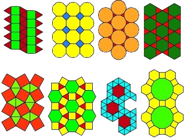

# Regular Simple Polygons
In Euclidean geometry, a regular polygon is a polygon that is equiangular (all angles are equal in measure) and equilateral (all sides have the same length). A simple polygon is one that does not intersect itself anywhere. Below we can see various mosaics made of regular polygons.

You must write a program that, given the number and the length of sides of a regular polygon, show its perimeter.

## Input
The input are two positive integers: **N** and **L**, which are, respectively, the number of sides and the length of each side of a regular polygon (3 ≤ **N** ≤ 1000000 and 1 ≤ **L** ≤ 4000).

## Output
The output is the perimeter **P** of the regular polygon in a single line.

|  Input Samples  | Output Samples |
|-----------------|----------------|
| 3 1             | 3              |
| 9 8             | 72             |
| 1000000 1000    | 1000000000     |