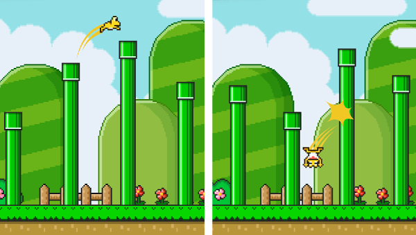

# Jumping Frog
In each stage of the Jumping Frog game you must safely get your amphibian through a sequence of pipes of different heights to the rightmost pipe. Nevertheless the frog just survives if the height difference of consecutive pipes is at most the frog jump height. If the next pipe height is too high, the frog hits the pipe and fall. If the next pipe height is too low, the frog does not survive the fall. The frog always starts on the top of the leftmost pipe.

In this game the distance of pipes is irrelevant, which means that the frog always can reach the next pipe with a jump.

You must write a program that, given the pipe heights and the frog jump height, show if the game stage can be beaten or not.

## Input
The input is given in two lines. The first one has two positive integer numbers **P** and **N**, the frog jump height and the number of pipes (1 ≤ **P** ≤ 5 and 2 ≤ **N** ≤ 100). The second line has **N** positive integer numbers that indicate the pipes heights ordered from left to right. There are no height greater than 10.

## Output
The output is given in a single line. If the frog can reach the rightmost pipe write "YOU WIN". If the frog fails, write "GAME OVER".

|         Input Samples        | Output Samples |
|------------------------------|----------------|
| 5 10  1 3 6 9 7 2 4 5 8 3 | YOU WIN        |
| 1 2  2 2                  | YOU WIN        |
| 1 2  1 3                  | GAME OVER      |