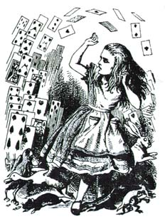

# Throwing Cards Away

Given in an ordered deck of *n* cards numbered 1 to *n* with card 1 at the top and card *n* at the bottom. The following operation is performed as long as there are at least two cards in the deck:

Throw away the top card and move the card that is now on the top of the deck to the bottom of the deck.

Your task is to find the sequence of discarded cards and the last, remaining card.

Each line of input (except the last) contains a number *n* ≤ 50. The last line contains 0 and this line should not be processed. For each number from the input produce two lines of output. The first line presents the sequence of discarded cards, the second line reports the last remaining card.

## Input
The input file contains a non determinated number of lines. Each line contains an integer number. The last line contain the number zero (0).

## Output
For each test case, print two lines. The first line presents the sequence of discarded cards, each number separated by a comma ',' and one blank space. The second line reports the last remaining card. No line will have leading or trailing spaces. See the sample for the expected format.

|        Input Samples        |                                                                                                                                          Output Samples                                                                                                                                          |
|-----------------------------|--------------------------------------------------------------------------------------------------------------------------------------------------------------------------------------------------------------------------------------------------------------------------------------------------|
| 7  19  10  6  0 | Discarded cards: 1, 3, 5, 7, 4, 2  Remaining card: 6  Discarded cards: 1, 3, 5, 7, 9, 11, 13, 15, 17, 19, 4, 8, 12, 16, 2, 10, 18, 14  Remaining card: 6  Discarded cards: 1, 3, 5, 7, 9, 2, 6, 10, 8  Remaining card: 4  Discarded cards: 1, 3, 5, 2, 6  Remaining card: 4 |