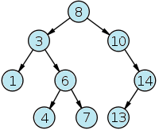

# Binary Search Tree
In computer science, a binary search tree (BST), which may sometimes also be called an ordered or sorted binary tree, is a node-based binary tree data structure which has the following properties:

* The left subtree of a node contains only nodes with keys less than the node's key.
* The right subtree of a node contains only nodes with keys greater than or equal to the node's key.
* Both the left and right subtrees must also be binary search trees.

The major advantage of binary search trees over other data structures is that the related sorting algorithms and search algorithms such as in-order traversal can be very efficient.

For this problem, you will receive many set of numbers and from each set you must to build the BST equivalent. For example, an imput with the sequence of numbers: 8 3 10 14 6 4 13 7 1 will result in the following binary search tree:

## Input
The input file contains many test cases. The first line of input contains an integer **C** (**C** ≤ 1000), indicating the number of test cases that follow. Each test case contains two lines. The first line contains a number **N** (1 ≤ **N** ≤ 500) indicating the amount of numbers that will form each one of the trees. The second line contains the **N** distinct non-negative numbers, each one separated by a space.

## Output
For each input set, you should print the message "Case n:", where n is the sequential test case number, followed by 3 lines with the pre-order, in-order, post-order transversal for the current tree formatted according to the given example. 

Note: None space must be printed after the last number of each line and the program should print a blank line after each test case, even after the last test case.

|                   Input Samples                  |                                                                            Output Samples                                                                            |
|--------------------------------------------------|----------------------------------------------------------------------------------------------------------------------------------------------------------------------|
| 2  3  5 2 7  9  8 3 10 14 6 4 13 7 1 | Case 1:  Pre.: 5 2 7  In..: 2 5 7  Post: 2 7 5   Case 2:  Pre.: 8 3 1 6 4 7 10 14 13  In..: 1 3 4 6 7 8 10 13 14  Post: 1 4 7 6 3 13 14 10 8 |